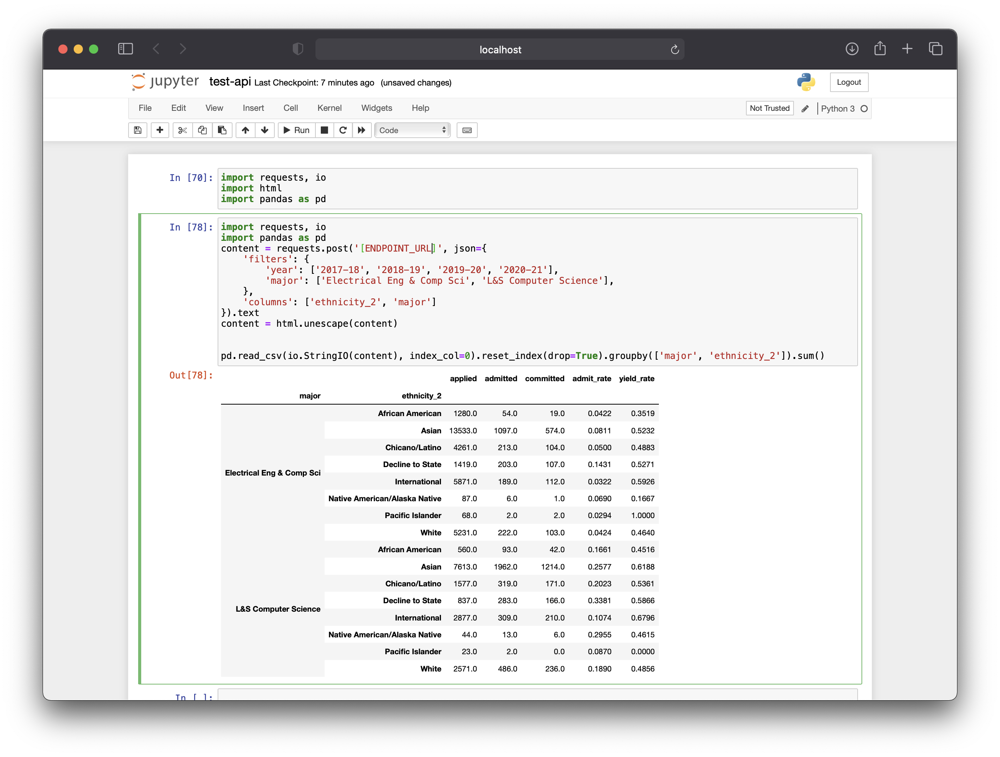

# Cal Admissions API

This is an API endpoint to the Cal Admissions dataset, designed for research purposes! 

### Endpoint

For access to the live API endpoint, please contact Shomil (via Berkeley email). 

### Example

To query data, make a POST Request to the endpoint with a JSON body containing `filters` and `columns` that specify your query. The endpoint will return a table in CSV, which can then be read into Pandas.



### Columns

##### department

```
African American Studies
Ag & Resource Econ & Pol
Anthropology
Architecture
Art Practice
Astronomy
Bioengineering
Chem & Biomolecular Eng
Chemistry
City & Regional Planning
Civil & Environmental Eng
Classics
Comparative Literature
Earth & Planetary Science
East Asian Lang & Culture
Economics
Electrical Eng & Computer Sci
Engineering Science
English
Env Sci, Policy, & Mgmt
Ethnic Studies
Film and Media
French
Gender & Womens Studies
Geography
German
History
History of Art
Industrial Eng & Ops Research
Integrative Biology
Interdisc Social Science Pgms
Italian Studies
L&S Chemistry
L&S Computer Science
L&S Data Science
L&S Envir Econ & Policy
L&S Legal Studies
L&S Ops Rsch & Mgmt Sci
L&S Public Health
L&S Social Welfare
L&S Undeclared
Landscape Arch & Env Plan
Linguistics
Materials Science & Eng
Mathematics
Mechanical Engineering
Molecular & Cell Biology
Music
Near Eastern Studies
Nuclear Engineering
Nutritional Sciences & Tox
Other Arts & Humanities Pgms
Other Bio Sciences Pgms
Other Chemistry Programs
Other Clg of Natural Res Pgms
Other Math & Physical Sci Pgms
Other Social Sciences Programs
Philosophy
Physics
Plant & Microbial Biology
Political Science
Psychology
Rhetoric
Scandinavian
Slavic Languages & Literatures
Sociology
South & SE Asian Studies
Spanish & Portuguese
Statistics
Theater Dance & Perf Stds
UG Interdisciplinary Studies
```
##### ethnicity_1

```
Asian/Pacific Islander
International
Underrepresented Minority
White/Other
```
##### ethnicity_2

```
African American
Asian
Chicano/Latino
Decline to State
International
Native American/Alaska Native
Pacific Islander
White
```
##### ethnicity_3

```
African American/Black
Chinese
Decline to State
Filipino
International
Japanese
Korean
Mexican American/Chicano
Native American/Alaska Native
Other Asian
Other Hispanic/Latino
Pacific Islander
South Asian
Vietnamese
White
```
##### family_income

```
$0-25K
$150K+
$25-60K
$60-80K
$80-150K
Unknown
```
##### first_gen_student

```
FG
NFG
Unknown
```
##### gender

```
Decline to State
Female
Male
Nonbinary
```
##### major

```
Afr Amer Stds-Humanities
Afr Amer Stds-Social Sci
African American Studies
Altaic Language
American Studies
Ancient NE Civilizations
Ancnt Egypt/NE Art & Archae
Ancnt NE Archae & Art Hist
Anthropology
Applied Mathematics
Architecture
Art
Asian Am & Asian Diasp St
Asian American Studies
Asian Studies - China
Asian Studies - India
Asian Studies - Japan
Asian Studies - SE Asia
Asian Studies-SE Asia
Astronomy
Astrophysics
Atmospheric Science
BioEng + BusAdm MET Pgm
Bioengineering
Biology+Business Program
Bioresource Sciences
CNR Undeclared
Celtic Studies
Chemical Biology
Chemical Engineering
Chemistry
Chicano Studies
Chinese Language
CivEng + BusAdm MET Pgm
Civil Engineering
Classical Civilizations
Classical Languages
Cognitive Science
Comparative Literature
Computational Eng Science
Conserv & Resource Stds
Dance & Perf Studies
Development Studies
Double Major
Dramatic Art
Dramatic Art - Dance
Dutch Studies
E Asian Rel, Thought, & Cul
EECS+Business Admin MET Pgm
Earth & Planetary Science
Earth Resources Eng
Earth Science
Eco Mgmt & For-Forestry
Eco Mgmt & For-Nat Res Mgmt
Economics
Electrical Eng & Comp Sci
Energy Engineering
Eng Math & Statistics
Engin Undec + BusAdm MET Pgm
Engineering Physics
Engineering Undeclared
English
Entomology
Environ Econ & Policy
Environ Sci-Biol Sci
Environ Sci-Physical Sci
Environ Sci-Soc Sci
Environmental Earth Science
Environmental Eng Science
Environmental Sciences
Environmental Studies
Ethnic Studies
Film
Forestry
Forestry & Natural Resources
French
Gender & Womens Studies
General Engineering Sci
Genetics & Plant Biology
Geography
Geology
Geophysics
German
Global Studies
Greek
Haas Global Mgmt Program
History
History of Art
Human Biodynamics
IEOR+Business Admin MET Pgm
Industrial Eng & Ops Rsch
Integrative Biology
Intending Arts Hum/Soc Sci
Intending Business Admin
Intending Math/Phys/Bio Sci
Intending Unspecified L&S
Interdisciplinary Studies
Italian
Italian Studies
Japanese Language
L&S Chemistry
L&S Computer Science
L&S Data Science
L&S Environ Econ & Policy
L&S Environmental Sciences
L&S Environmental Studies
L&S Legal Studies
L&S Ops Research & Mgmt Sci
L&S Public Health
L&S Social Welfare
Landscape Architecture
Latin
Latin American Studies
Letters & Sci Undeclared
Linguistics
MCB-Biochem & Mol Biol
MCB-Cell & Dev Biology
MCB-Genetics
MCB-Immunology
MCB-Neurobiology
ME+Business Admin MET Pgm
Manufacturing Engineering
Marine Science
Mass Communications
MatSci Eng + BusAdm MET Pgm
Materials Science & Eng
Mathematics
Mechanical Engineering
Media Studies
Microbial Biology
Middle Eastern Studies
Mills 3+2 Engineering Pgm
Molecular & Cell Biology
Molecular Environ Biology
Molecular Toxicology
Music
Native American Studies
Near Eastern Civilizations
Near Eastern Lang & Lit
Near Eastern Studies
Nuclear Engineering
Nutrition & Food Science
Nutritional Science
Peace & Conflict Studies
Philosophy
Physical Sci Field Major
Physics
Planetary Science
Pol Econ of Indust Soc
Pol Econ of Nat Resources
Political Economy
Political Science
Psychology
Religious Studies
Resource Management
Rhetoric
Scandinavian
Slavic Lang & Lit
Society and Environment
Sociology
Soil Environment
South & SE Asian Studies
Spanish and Portuguese
Spanish-Hisp Lang/Biling Iss
Spanish-Latin-Amer Lang & Lit
Spanish-Luso-Brazil Lang & Lit
Spanish-Spanish Lang & Lit
Statistics
Sustainable Environ Dsgn
Theater & Perf Studies
Undecided Arts & Humanities
Undecided Bio Sciences
Undecided Math Physical Sci
Undecided Social Sciences
Undecided Undergrad Studies
Urban Studies
Womens Studies
```
##### residency

```
CA Resident
International
Out of State Domestic
Unknown
```
##### school

```
Clg of Chemistry
Clg of Engineering
Clg of Environmental Design
Clg of Letters & Science
Rausser Clg Natural Resources
```
##### year

```
1996-97
1997-98
1998-99
1999-00
2000-01
2001-02
2002-03
2003-04
2004-05
2005-06
2006-07
2007-08
2008-09
2009-10
2010-11
2011-12
2012-13
2013-14
2014-15
2015-16
2016-17
2017-18
2018-19
2019-20
2020-21
```
